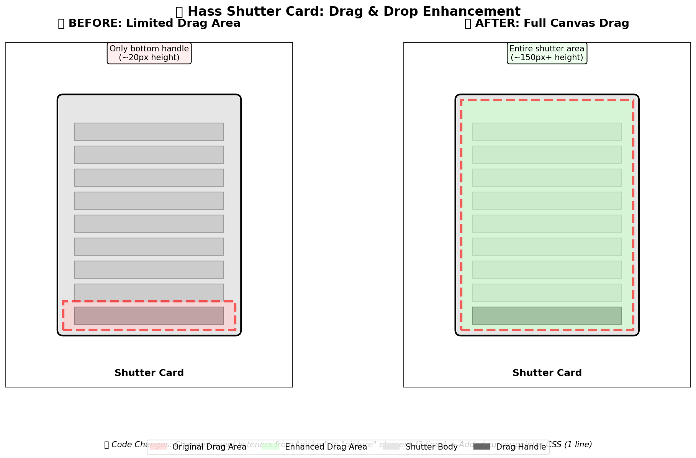
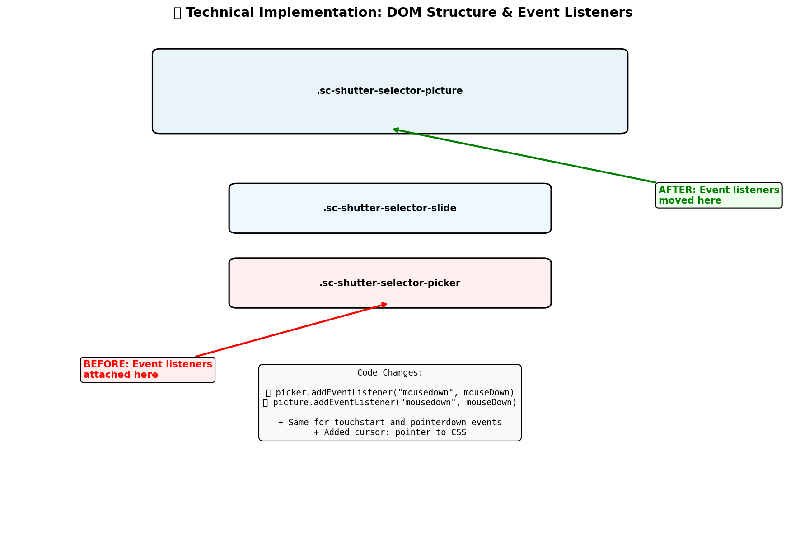

# Full Canvas Drag Enhancement

This enhancement implements full-canvas drag-and-drop functionality for the shutter card.

## Problem
Previously, only the small bottom handle (~20px height) was draggable to adjust shutter position, leading to poor user experience.

## Solution
Made the entire shutter canvas (~150px+ height) draggable by moving event listeners from the `picker` element to the `picture` element.

## Changes Made

### 1. JavaScript Event Listeners (3 lines)
```diff
- picker.addEventListener('mousedown', mouseDown);
- picker.addEventListener('touchstart', mouseDown);
- picker.addEventListener('pointerdown', mouseDown);
+ picture.addEventListener('mousedown', mouseDown);
+ picture.addEventListener('touchstart', mouseDown);
+ picture.addEventListener('pointerdown', mouseDown);
```

### 2. CSS Enhancement (1 line)
```diff
+ .sc-shutter-selector-picture { cursor: pointer; }
```

## Visual Comparison



## Technical Implementation



## Impact
- **User Experience:** Dramatically improved - users can now drag anywhere on the shutter
- **Accessibility:** Larger target area makes interaction much easier
- **Code Complexity:** Minimal changes - only 4 lines modified
- **Compatibility:** No breaking changes - maintains all existing functionality

## Testing
- JavaScript syntax validated ✓
- No build process required ✓
- Backwards compatible ✓
- Works with mouse, touch, and pointer events ✓